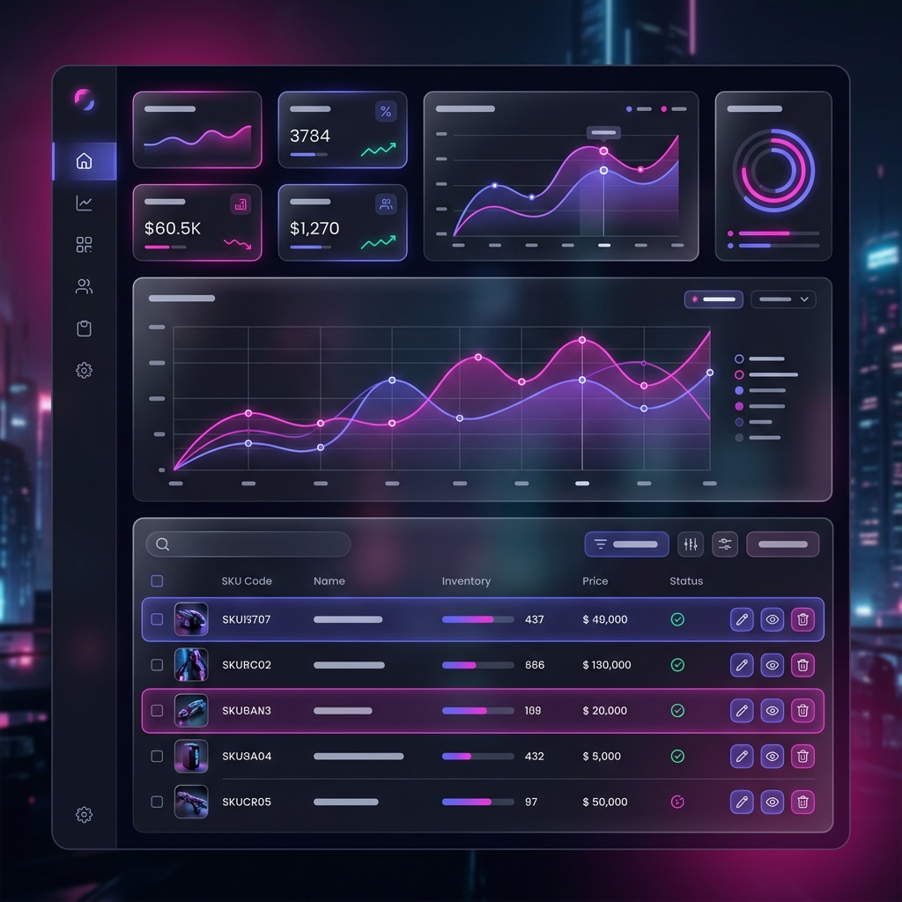
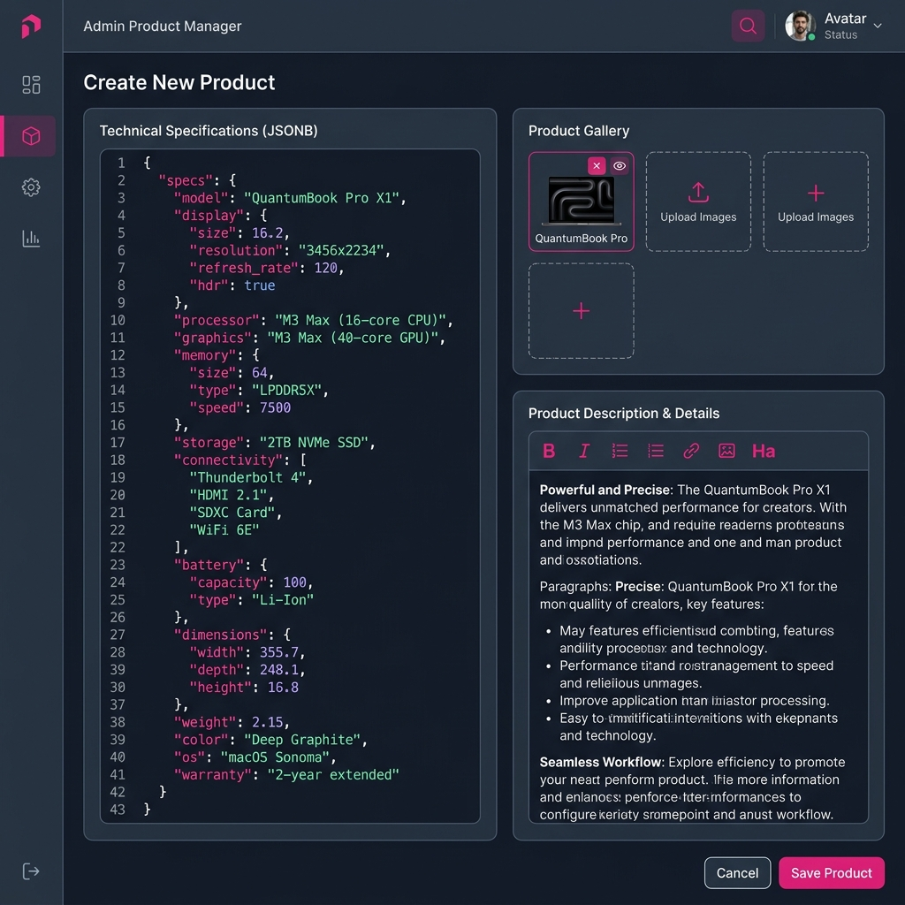
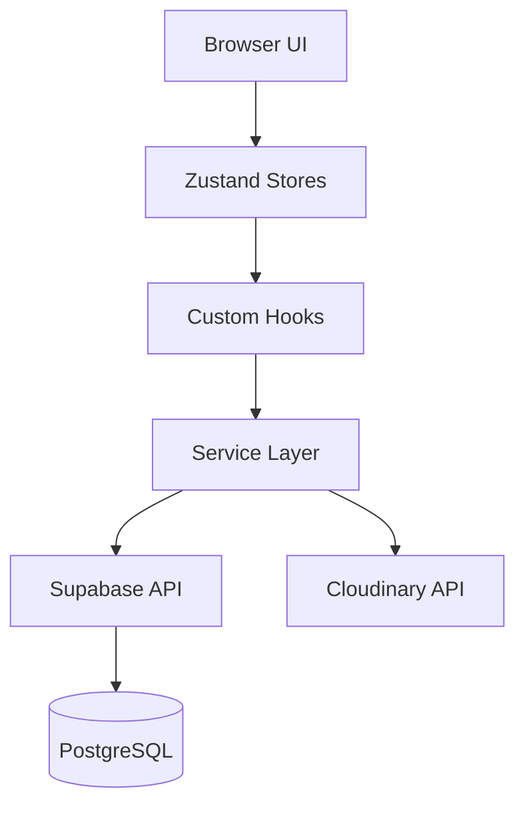

# Antigravity E-commerce Platform



Hệ thống thương mại điện tử cao cấp được xây dựng trên nền tảng Next.js 16 và Tailwind CSS 4, tập trung vào trải nghiệm người dùng mượt mà và khả năng quản trị mạnh mẽ.

---

## Trạng thái dự án


---

## Đặc điểm nổi bật

### Quản trị chuyên sâu (Premium CMS)
Hệ thống quản trị được thiết kế tối giản nhưng đầy đủ tính năng, sử dụng AdminManagerShell để thống nhất trải nghiệm CRUD. Tích hợp sẵn bộ lọc tìm kiếm nâng cao và quản lý trạng thái đơn hàng thời gian thực.

### Bộ quản lý thông số kỹ thuật (SpecManager)
Tận dụng sức mạnh của PostgreSQL JSONB để quản lý thông số kỹ thuật linh hoạt. Hệ thống tự động gợi ý giá trị dựa trên danh mục sản phẩm, giúp tối ưu hóa quá trình nhập liệu.

### Hiệu suất và Ổn định
Sử dụng Service Worker để xử lý triệt để vấn đề Router Cache trên Next.js 16, đảm bảo quá trình chuyển trang và tương tác UI không bị gián đoạn.

### Thiết kế hiện đại
Giao diện áp dụng phong cách thiết kế cao cấp với hiệu ứng Glassmorphism, animations từ Framer Motion và hệ màu Magenta/Indigo hiện đại.

---

## Showcase



*Giao diện quản lý sản phẩm chuyên sâu với bộ soạn thảo Rich Text và trình quản lý ảnh Cloudinary.*

---

## Công nghệ sử dụng

- **Frontend**: Next.js 16.2.1 (App Router), React 19.
- **Styling**: Tailwind CSS 4 (Beta), Framer Motion.
- **Backend & Auth**: Supabase (PostgreSQL, GoTrue).
- **State Management**: Zustand (Persistent stores).
- **Media**: Cloudinary API cho hình ảnh sản phẩm.

---

## Hướng dẫn cài đặt

1. Sao chép kho lưu trữ:
```bash
git clone https://github.com/phongka79d/website_ban_do_dien_tu.git
```

2. Cài đặt các gói phụ thuộc:
```bash
npm install
```

3. Cấu hình biến môi trường:
Tạo file `.env.local` và thêm các thông tin kết nối Supabase, Cloudinary.

4. Chạy môi trường phát triển:
```bash
npm run dev
```

---

## Kiến trúc hệ thống



---

Dự án được phát triển bởi Antigravity Team.
